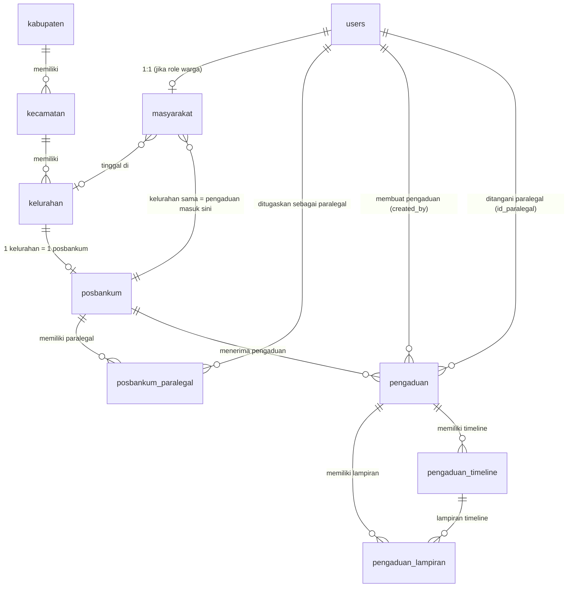
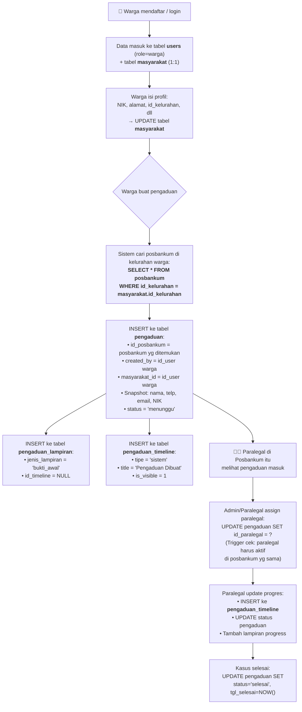

# Analisis Struktur Database `posbankum_db` — Lengkap

## 1. Diagram Relasi Antar Tabel (ERD)



---

## 2. Hierarki Wilayah

```
kabupaten ─┬─ kecamatan ─┬─ kelurahan ─── posbankum (1:1)
           │              │                    │
           │              │                    ├── posbankum_paralegal (banyak paralegal)
           │              │                    │
           │              └─ kelurahan ─── ...
           │
           └─ kecamatan ─── ...
```

| Tabel | PK | FK | Catatan |
|---|---|---|---|
| `kabupaten` | `id_kabupaten` (UUID) | — | Root wilayah |
| `kecamatan` | `id_kecamatan` (UUID) | `id_kabupaten` → `kabupaten` | ON DELETE CASCADE ✅ |
| `kelurahan` | `id_kelurahan` (UUID) | `id_kecamatan` → `kecamatan` | ON DELETE CASCADE ✅, punya `jenis` dan `kode_pos` |
| `posbankum` | `id_posbankum` (UUID) | `id_kelurahan` → `kelurahan` (UNIQUE) | **1 kelurahan = maks 1 posbankum** ✅ |

> [!TIP]
> Hierarki wilayah sudah benar. UNIQUE KEY pada `id_kelurahan` di tabel `posbankum` memastikan tidak ada 2 posbankum di kelurahan yang sama.

---

## 3. Tabel `users` (Semua Role)

| Kolom | Tipe | Catatan |
|---|---|---|
| `id_user` | char(36) PK | UUID, auto-generate oleh trigger |
| `nama_lengkap` | varchar(255) | NOT NULL |
| `email` | varchar(255) | NOT NULL |
| `google_id` | varchar(255) | Nullable, untuk login Google |
| `password_hash` | varchar(255) | NOT NULL |
| `role` | enum('admin','paralegal','warga') | Default 'warga' |
| `nip`, `email_kantor`, `nomor_kantor`, `jabatan`, `unit_kerja`, `alamat_kantor` | various | Kolom khusus admin/paralegal kantor |
| `nomor_telepon` | varchar(30) | Nullable |
| `foto_profile` | text | Nullable |
| `status` | enum('aktif','nonaktif') | Default 'aktif' |

**Verdict**: ✅ Sudah benar.

---

## 4. Tabel `masyarakat` (Data Kependudukan Warga)

| Kolom | Tipe | FK | Catatan |
|---|---|---|---|
| `id_user` | char(36) **PK** | → `users.id_user` | **1:1 dengan users** |
| `nik` | varchar(30) | — | Nullable |
| `alamat` | text | — | Alamat detail tinggal |
| `id_kabupaten` | char(36) | → `kabupaten` | ON DELETE SET NULL |
| `id_kecamatan` | char(36) | → `kecamatan` | ON DELETE SET NULL |
| `id_kelurahan` | char(36) | → `kelurahan` | ON DELETE SET NULL |

**Verdict**: ✅ Sudah benar.

> [!NOTE]
> `id_user` menjadi PK sekaligus FK, artinya 1 user = 1 record masyarakat (relasi 1:1).  
> `id_kelurahan` pada masyarakat inilah yang **menentukan pengaduan warga masuk ke posbankum mana** — karena posbankum juga berelasi ke `id_kelurahan` yang sama.

> [!WARNING]
> **Kekurangan ditemukan**: Tidak ada FK dari `masyarakat.id_user` ke `users.id_user`!
> 
> Di bagian indexes (baris 741-745), `id_user` hanya dijadikan PRIMARY KEY tanpa constraint FK eksplisit ke tabel `users`. Meskipun secara logis benar (PK masyarakat = id_user dari users), **sebaiknya ditambahkan FK** agar integritas referensial terjaga.
> 
> Tambahkan:
> ```sql
> ALTER TABLE `masyarakat`
>   ADD CONSTRAINT `fk_masyarakat_user` FOREIGN KEY (`id_user`) 
>   REFERENCES `users` (`id_user`) ON DELETE CASCADE;
> ```

---

## 5. Tabel `pengaduan`

| Kolom | Tipe | FK | Catatan |
|---|---|---|---|
| `id_pengaduan` | char(36) PK | — | UUID auto-generate |
| `id_posbankum` | char(36) **NOT NULL** | → `posbankum` | **Ke posbankum mana pengaduan ini masuk** |
| `id_kabupaten` | char(36) | → `kabupaten` | Wilayah kejadian |
| `id_kecamatan` | char(36) | → `kecamatan` | Wilayah kejadian |
| `id_kelurahan` | char(36) | → `kelurahan` | Wilayah kejadian |
| `nomor_pengaduan` | varchar(100) | — | Nomor referensi unik |
| `nama_pelapor` | varchar(255) | — | Snapshot nama saat buat pengaduan |
| `nomor_telepon` | varchar(30) | — | Snapshot kontak |
| `email` | varchar(255) | — | Snapshot email |
| `nik` | varchar(30) | — | Snapshot NIK |
| `jenis_masalah` | varchar(150) | — | Kategori masalah |
| `judul_pengaduan` | varchar(255) | — | Judul |
| `kronologi` | text | — | Detail kejadian |
| `tanggal_kejadian` | date | — | Kapan terjadi |
| `waktu_kejadian` | time | — | Nullable |
| `lokasi_kejadian` | text | — | Tempat kejadian |
| `status` | enum | — | `menunggu`, `diproses`, `selesai`, `dibatalkan` |
| `prioritas` | enum | — | 5 level prioritas |
| `catatan_internal` | text | — | Catatan khusus paralegal/admin |
| `tgl_selesai` | datetime | — | Kapan case ditutup |
| `created_by` | char(36) **NOT NULL** | → `users` | **Siapa yang buat** (id_user warga) |
| `masyarakat_id` | char(36) | → `users` | Link ke data masyarakat |
| `id_paralegal` | char(36) | → `users` | Paralegal yang menangani, nullable awalnya |

**Verdict**: ✅ Sudah cukup baik, dengan beberapa catatan:

> [!NOTE]
> **Desain snapshot (denormalisasi) sudah tepat!**  
> Kolom `nama_pelapor`, `nomor_telepon`, `email`, `nik` di tabel `pengaduan` adalah **snapshot data saat pengaduan dibuat**. Ini penting karena warga bisa mengubah profil-nya di kemudian hari, tapi data pengaduan tetap mencerminkan keadaan saat pengaduan dibuat. Ini best practice di dunia nyata. ✅

> [!WARNING]
> **Catatan tentang `masyarakat_id`**:
> - FK-nya merujuk ke `users.id_user` (bukan ke tabel `masyarakat`), padahal nama kolomnya `masyarakat_id`. Ini secara fungsional tetap benar karena `masyarakat.id_user` = `users.id_user`, tapi naming-nya agak misleading.
> - Kolom `created_by` dan `masyarakat_id` kemungkinan berisi nilai yang sama (keduanya user warga yang membuat pengaduan). Ini bisa jadi redundan, tapi tidak masalah jika `created_by` direncanakan untuk kasus di mana admin/paralegal yang membuat pengaduan atas nama warga (`masyarakat_id` = warga, `created_by` = admin).

**Trigger `pengaduan_before_update`** — sangat bagus! ✅
```
Mengecek bahwa id_paralegal yang di-assign harus:
1. User dengan role 'paralegal'
2. Status user 'aktif'  
3. Terdaftar di posbankum_paralegal dengan id_posbankum yang SAMA dan status 'aktif'
```
Ini mencegah salah assign paralegal dari posbankum lain.

---

## 6. Tabel `pengaduan_lampiran`

| Kolom | Tipe | FK | Catatan |
|---|---|---|---|
| `id_lampiran` | char(36) PK | — | UUID auto-generate |
| `id_pengaduan` | char(36) **NOT NULL** | → `pengaduan` | ON DELETE CASCADE ✅ |
| `id_timeline` | char(36) | → `pengaduan_timeline` | ON DELETE SET NULL, nullable |
| `nama_file` | varchar(255) | — | Nama file asli |
| `path_file` | text | — | Path penyimpanan |
| `mime_type` | varchar(150) | — | Tipe file |
| `size_bytes` | bigint | — | Ukuran file |
| `jenis_lampiran` | enum | — | `bukti_awal`, `progress`, `chat`, `lainnya` |
| `created_by` | char(36) | → `users` | Siapa yang upload |

**Verdict**: ✅ Sudah benar dan lengkap.

> [!TIP]
> Desain ini fleksibel:
> - Lampiran bisa milik pengaduan secara umum (`id_timeline` = NULL, `jenis_lampiran` = 'bukti_awal')
> - Atau bisa terikat ke timeline event tertentu (`id_timeline` terisi, `jenis_lampiran` = 'progress')

---

## 7. Tabel `pengaduan_timeline`

| Kolom | Tipe | FK | Catatan |
|---|---|---|---|
| `id_timeline` | char(36) PK | — | UUID auto-generate |
| `id_pengaduan` | char(36) **NOT NULL** | → `pengaduan` | ON DELETE CASCADE ✅ |
| `tipe` | enum | — | `status`, `catatan`, `lampiran`, `sistem` |
| `title` | varchar(255) | — | Judul event |
| `deskripsi` | text | — | Detail event |
| `is_visible` | tinyint(1) | — | Tampilkan ke warga atau tidak |
| `tanggal` | datetime | — | Default CURRENT_TIMESTAMP |
| `created_by` | char(36) | → `users` | Siapa yang buat |

**Verdict**: ✅ Sudah benar dan bagus.

> [!TIP]
> `is_visible` sangat berguna — paralegal bisa membuat catatan internal (is_visible=0) yang tidak dilihat warga, seperti notes investigasi.

---

## 8. Alur Logika Fitur Pengaduan (dari sisi Database)



### Penjelasan Naratif:

1. **Warga daftar** → record di `users` (role='warga') + record kosong di `masyarakat`
2. **Warga lengkapi profil** → `masyarakat` diisi `id_kelurahan`, `alamat`, `nik`, dll
3. **Warga buat pengaduan** → Backend Laravel cari `posbankum` yang `id_kelurahan`-nya **sama** dengan `masyarakat.id_kelurahan`. Lalu INSERT pengaduan dengan `id_posbankum` itu.
4. **Paralegal di posbankum itu** melihat pengaduan masuk di dashboard mereka (filter: `WHERE pengaduan.id_posbankum = posbankum_paralegal.id_posbankum`)
5. **Paralegal di-assign** ke pengaduan (`id_paralegal` diisi), trigger memastikan paralegal tsb aktif di posbankum yg sama
6. **Timeline tracking** → setiap perubahan status, catatan, atau lampiran baru dicatat di `pengaduan_timeline`
7. **Kasus selesai** → status di-update, `tgl_selesai` diisi

---

## 9. Ringkasan Temuan & Saran

### ✅ Yang Sudah Benar

| Item | Penjelasan |
|---|---|
| Hirarki Wilayah | Kabupaten → Kecamatan → Kelurahan, FK CASCADE benar |
| 1 Kelurahan = 1 Posbankum | Dijaga oleh UNIQUE KEY di `posbankum.id_kelurahan` |
| Relasi Paralegal | `posbankum_paralegal` sebagai tabel pivot, UNIQUE (id_posbankum, id_user) |
| Trigger Validasi | Paralegal di pengaduan harus aktif di posbankum yang sama |
| Snapshot Data Pelapor | `nama_pelapor`, `nik`, `email`, `nomor_telepon` di pengaduan terpisah dari master data |
| Timeline & Lampiran | Desain fleksibel, lampiran bisa standalone atau terikat timeline |
| UUID Auto-generate | Semua tabel pakai trigger `before_insert` untuk generate UUID |

### ⚠️ Kekurangan yang Ditemukan

| # | Issue | Tingkat | Saran Perbaikan |
|---|---|---|---|
| 1 | **Tidak ada FK `masyarakat.id_user` → `users.id_user`** | 🟡 Sedang | Tambahkan `ALTER TABLE masyarakat ADD CONSTRAINT fk_masyarakat_user FK (id_user) REFERENCES users(id_user) ON DELETE CASCADE` |
| 2 | **`nomor_pengaduan` di tabel `pengaduan` tidak ada UNIQUE KEY** | 🟡 Sedang | Tambahkan UNIQUE KEY agar tidak ada nomor pengaduan duplikat |
| 3 | **Penamaan `masyarakat_id`** inkonsisten | 🟢 Minor | Naming convention lain pakai `id_xxx`, tapi `masyarakat_id` pakai suffix `_id`. Tidak breaking, tapi membingungkan contributor baru |
| 4 | **Tidak ada trigger `pengaduan_before_insert` untuk validasi `id_paralegal`** | 🟢 Minor | Hanya ada trigger `before_update`. Secara logis OK karena biasanya paralegal di-assign setelah pengaduan dibuat (via UPDATE), tapi jika ada kasus edge insert langsung dengan id_paralegal, tidak tervalidasi |
| 5 | **Tabel `masyarakat` tidak ada updated_at trigger/auto-update yang eksplisit di kolom definisi** | 🟢 Sudah ada | Ternyata sudah ada: `ON UPDATE CURRENT_TIMESTAMP` ✅ |
