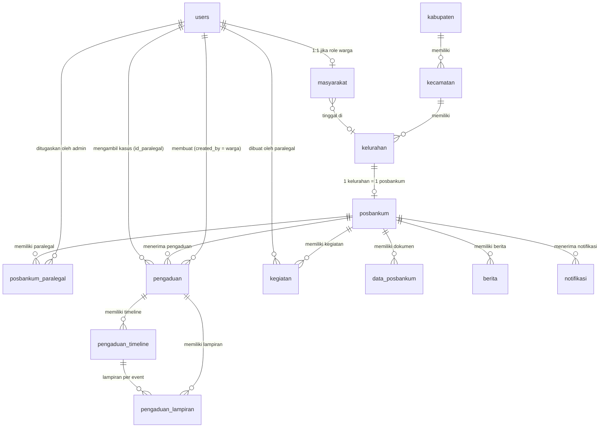
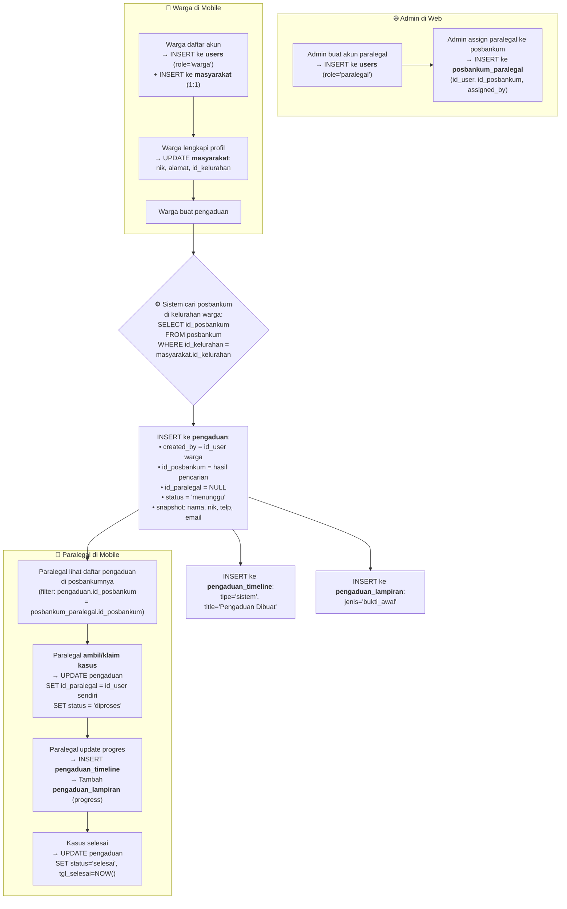
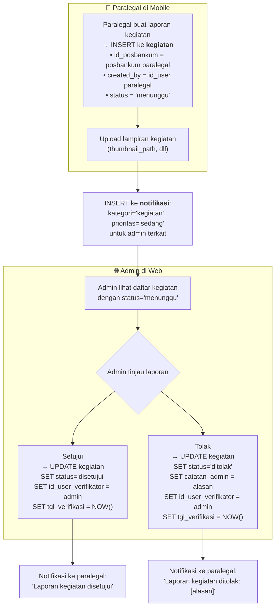

# Analisis Struktur Database `posbankum_db` — Revisi Final

---

## 1. Diagram Relasi Antar Tabel (ERD)



---

## 2. Pembagian Peran (Penting!)

| Peran | Platform | Apa yang mereka lakukan |
|---|---|---|
| **Admin** | 🌐 Web | Membuat akun paralegal, mengatur paralegal ditugaskan ke posbankum mana (`users` + `posbankum_paralegal`), **menyetujui/menolak laporan kegiatan paralegal** |
| **Paralegal** | 📱 Mobile | Melihat pengaduan yang masuk ke posbankumnya, **mengambil/klaim kasus sendiri**, **upload laporan kegiatan** |
| **Warga** | 📱 Mobile | Mendaftar, melengkapi profil, membuat pengaduan |

> [!IMPORTANT]
> **Admin TIDAK meng-assign paralegal ke pengaduan tertentu.**  
> Admin hanya menentukan paralegal bekerja di posbankum mana. Setelah itu, paralegal sendiri yang melihat dan mengambil kasus yang masuk ke posbankumnya via aplikasi mobile.

---

## 3. Tentang `id_posbankum` vs `id_kelurahan` — Kapan Pakai yang Mana?

> [!NOTE]
> Ini pertanyaan penting karena 1 kelurahan = 1 posbankum, sehingga keduanya secara nilai selalu ekuivalen. Tapi ada perbedaan semantik yang harus dijaga konsisten.

| FK yang Dipakai | Semantiknya | Contoh Penggunaan |
|---|---|---|
| `id_kelurahan` | Identitas **wilayah geografis** | `masyarakat.id_kelurahan` (warga tinggal di mana), `pengaduan.id_kelurahan` (kejadian di wilayah mana), hierarki wilayah |
| `id_posbankum` | Identitas **lembaga/institusi** | `kegiatan`, `data_posbankum`, `notifikasi`, `pengaduan.id_posbankum` (lembaga penerima pengaduan) |

**Aturan praktisnya:** Jika suatu baris data "milik" atau "dikerjakan oleh" sebuah lembaga posbankum → pakai `id_posbankum`. Jika data itu hanya menyebut lokasi geografis suatu kejadian/tempat tinggal → pakai `id_kelurahan`.

Tabel `kegiatan`, `data_posbankum`, dan `notifikasi` sudah benar menggunakan `id_posbankum`. Jangan diganti ke `id_kelurahan` walaupun nilainya bisa di-lookup bolak-balik.

---

## 4. Tabel-Tabel Inti

### 4.1 Hierarki Wilayah

```
kabupaten → kecamatan → kelurahan → posbankum (1:1, UNIQUE KEY)
```

✅ Sudah benar. UNIQUE KEY pada `posbankum.id_kelurahan` mencegah 2 posbankum di kelurahan yang sama.

---

### 4.2 `users` — Semua Role

| Kolom Kunci | Catatan |
|---|---|
| `id_user` (PK, UUID) | Auto-generate oleh trigger |
| `role` | enum: `admin`, `paralegal`, `warga` |
| `nip`, `email_kantor`, `jabatan`, `unit_kerja`, `alamat_kantor` | Khusus staff (admin/paralegal) |
| `nomor_telepon`, `foto_profile` | Semua role |

✅ Sudah benar.

> [!NOTE]
> Paralegal **tidak membutuhkan kolom alamat tinggal**. Data yang bisa diubah paralegal sendiri hanyalah `nomor_telepon` yang sudah ada di tabel `users`.

---

### 4.3 `masyarakat` — Data Kependudukan Warga (1:1 dengan `users`)

| Kolom | Catatan |
|---|---|
| `id_user` (PK + FK) | = `users.id_user`, relasi 1:1 |
| `nik` | NIK kependudukan |
| `alamat` | Alamat tinggal detail |
| `id_kelurahan` | **Penentu pengaduan masuk ke posbankum mana** |

✅ Sudah benar. Tabel ini **khusus untuk warga saja**, jangan dipakai untuk paralegal.

---

### 4.4 `posbankum` — Institusi Pos Bantuan Hukum

| Kolom Kunci | Catatan |
|---|---|
| `id_posbankum` (PK, UUID) | Auto-generate |
| `id_kelurahan` (UNIQUE FK) | 1 kelurahan = 1 posbankum |
| `nama`, `alamat`, `email_akun`, `nomor_tlp` | Info institusi |
| `latitude`, `longitude` | Koordinat lokasi |
| `status_verifikasi_tagging_area` | Status verifikasi koordinat oleh admin |

✅ Sudah benar.

---

### 4.5 `posbankum_paralegal` — Penugasan Paralegal ke Posbankum

| Kolom | Catatan |
|---|---|
| `id_relasi` (PK, UUID) | Auto-generate |
| `id_posbankum` (FK) | Posbankum tujuan penugasan |
| `id_user` (FK) | User paralegal yang ditugaskan |
| `is_primary` | Paralegal utama? |
| `status` | aktif/nonaktif |
| `assigned_by` (FK) | **Admin** yang menugaskan |
| `assigned_at` | Kapan ditugaskan |

✅ Sudah benar. UNIQUE KEY `(id_posbankum, id_user)` mencegah duplikat.

**Siapa yang mengisi tabel ini?** → **Admin di web.** Admin membuat akun paralegal (`users`), lalu INSERT ke tabel ini untuk menentukan paralegal bekerja di posbankum mana.

---

### 4.6 `pengaduan` — Laporan/Aduan Warga

| Kolom | Fungsi | Diisi Oleh |
|---|---|---|
| `id_pengaduan` (PK) | UUID auto-generate | Trigger |
| `id_posbankum` (FK, NOT NULL) | Posbankum penerima pengaduan | **Sistem** — cari posbankum berdasarkan kelurahan warga |
| `id_kabupaten`, `id_kecamatan`, `id_kelurahan` | Wilayah kejadian | Warga (opsional) |
| `nama_pelapor`, `nomor_telepon`, `email`, `nik` | **Snapshot** data warga saat buat pengaduan | Warga (auto-fill dari profil) |
| `jenis_masalah`, `judul_pengaduan`, `kronologi` | Detail aduan | Warga |
| `tanggal_kejadian`, `waktu_kejadian`, `lokasi_kejadian` | Detail kejadian | Warga |
| `status` | `menunggu` → `diproses` → `selesai` / `dibatalkan` | Paralegal yang menangani |
| `prioritas` | 5 level | Paralegal |
| `catatan_internal` | Catatan kerja paralegal | Paralegal |
| `tgl_selesai` | Kapan case ditutup | Paralegal |
| `created_by` (FK, NOT NULL) | **id_user warga** yang membuat pengaduan | Warga |
| ~~`masyarakat_id`~~ | ❌ **SUDAH DIHAPUS** — redundan dengan `created_by` | — |
| `id_paralegal` (FK, nullable) | **id_user paralegal** yang **mengambil/klaim** kasus ini | **Paralegal sendiri** di mobile |

> [!IMPORTANT]
> **Trigger `pengaduan_before_update`** memvalidasi bahwa `id_paralegal` yang mengambil kasus **harus paralegal aktif yang terdaftar di posbankum yang sama** (`posbankum_paralegal`). Ini mencegah paralegal dari posbankum lain mengambil kasus yang bukan wilayahnya.

---

### 4.7 `pengaduan_lampiran` — Bukti & Dokumen Pengaduan

| Kolom Kunci | Catatan |
|---|---|
| `id_lampiran` (PK) | UUID |
| `id_pengaduan` (FK) | ON DELETE CASCADE |
| `id_timeline` (FK, nullable) | Terikat ke timeline event tertentu, atau NULL jika bukti awal |
| `jenis_lampiran` | `bukti_awal`, `progress`, `chat`, `lainnya` |
| `nama_file`, `path_file`, `mime_type`, `size_bytes` | Metadata file |

✅ Sudah benar.

---

### 4.8 `pengaduan_timeline` — Riwayat/Log Pengaduan

| Kolom Kunci | Catatan |
|---|---|
| `id_timeline` (PK) | UUID |
| `id_pengaduan` (FK) | ON DELETE CASCADE |
| `tipe` | `status`, `catatan`, `lampiran`, `sistem` |
| `title`, `deskripsi` | Detail event |
| `is_visible` | 1 = tampil ke warga, 0 = catatan internal paralegal |
| `created_by` (FK) | Siapa yang buat event ini |

✅ Sudah benar.

---

### 4.9 `kegiatan` — Laporan Kegiatan Paralegal

Tabel ini menyimpan laporan kegiatan yang di-upload paralegal dari mobile, kemudian ditinjau dan disetujui/ditolak oleh admin di web.

| Kolom | Fungsi | Diisi Oleh |
|---|---|---|
| `id_kegiatan` (PK, UUID) | Auto-generate | Trigger |
| `id_posbankum` (FK, NOT NULL) | Posbankum yang mengadakan kegiatan | **Sistem** — dari sesi login paralegal |
| `judul` | Nama/judul kegiatan | Paralegal |
| `deskripsi` | Deskripsi kegiatan | Paralegal |
| `catatan` | Catatan tambahan | Paralegal |
| `status` | Status approval (lihat ⚠️ di bawah) | Sistem / Admin |
| `tgl_upload` | Kapan diupload | Auto |
| `tgl_mulai`, `tgl_selesai` | Rentang tanggal kegiatan | Paralegal |
| `thumbnail_path` | Gambar kegiatan | Paralegal |
| `lokasi` | Lokasi kegiatan | Paralegal |
| `anggota_terlibat` (JSON) | Daftar anggota yang ikut | Paralegal |
| `kategori` | Jenis kegiatan | Paralegal |
| `hasil_kegiatan` | Laporan hasil | Paralegal |
| `created_by` (FK) | id_user paralegal yang upload | Paralegal |

> [!WARNING]
> **Kolom `status` bermasalah.** Saat ini bertipe `varchar(50)` dengan default `'draft'`. Ini tidak aman karena tidak ada constraint — value bisa diisi sembarangan. Harus diubah ke `ENUM` yang eksplisit.

> [!WARNING]
> **Kolom approval admin belum ada.** Tidak ada kolom untuk menyimpan siapa yang menyetujui, kapan disetujui, dan catatan penolakan. Bandingkan dengan `data_posbankum` yang sudah punya `status_verifikasi`, `id_user_verifikator`, `tgl_verifikasi`, `catatan_admin` — pattern itu yang harus diikuti. Lihat SQL perbaikan di [5.4](#54-perbaiki-tabel-kegiatan--tambah-kolom-approval).

**Alur kegiatan:**

```
Paralegal upload (mobile) → status='menunggu'
       ↓
Admin tinjau di web
       ↓
    Disetujui → status='disetujui', id_user_verifikator & tgl_verifikasi terisi
    Ditolak   → status='ditolak',  catatan_admin terisi (alasan penolakan)
```

---

### 4.10 `data_posbankum` — Dokumen/Berkas Posbankum

Tabel ini menyimpan dokumen resmi posbankum (SK, SOP, dll) yang diupload dan diverifikasi admin.

| Kolom Kunci | Catatan |
|---|---|
| `id_data` (PK, UUID) | Auto-generate |
| `id_posbankum` (FK) | Posbankum pemilik dokumen |
| `kategori` | Jenis dokumen |
| `path_berkas`, `nama_berkas`, `mime_type`, `size_bytes` | Metadata file |
| `status_verifikasi` | `menunggu` / `disetujui` / `ditolak` |
| `id_user_verifikator` (FK, nullable) | Admin yang memverifikasi |
| `tgl_verifikasi` | Kapan diverifikasi |
| `catatan_admin` | Catatan dari admin (alasan tolak, dll) |

✅ Struktur approval sudah benar di tabel ini — jadikan referensi untuk `kegiatan`.

---

### 4.11 `berita` — Artikel/Berita Posbankum

| Kolom Kunci | Catatan |
|---|---|
| `id_berita` (PK, UUID) | Auto-generate |
| `id_user` (FK) | Pembuat berita |
| `judul`, `isi`, `gambar` | Konten |
| `tgl_publish` | Waktu publish |
| `kategori` | Default `'Kegiatan'` |

> [!NOTE]
> Tabel `berita` tidak punya `id_posbankum`. Ini bisa jadi masalah jika berita perlu difilter per posbankum — tapi jika berita bersifat global (semua posbankum bisa lihat), maka ini bisa diterima. **Perlu konfirmasi dengan tim apakah berita bersifat per-posbankum atau global.**

---

### 4.12 `notifikasi` — Notifikasi Sistem

| Kolom Kunci | Catatan |
|---|---|
| `id_notifikasi` (PK, UUID) | Auto-generate |
| `id_posbankum` (FK, NOT NULL) | Posbankum tujuan notifikasi |
| `id_user_penerima` (FK, nullable) | User penerima spesifik (atau NULL = broadcast ke posbankum) |
| `kategori` | `pengaduan`, `kegiatan`, `dokumen`, `sistem` |
| `prioritas` | `tinggi`, `sedang`, `rendah` |
| `ref_table`, `ref_id` | Referensi ke objek terkait (polimorfik) |
| `is_read`, `read_at` | Status baca |

✅ Sudah benar. Trigger `notifikasi_before_update` otomatis isi `read_at` saat `is_read` di-set 1.

---

### 4.13 `chat_pesan` — Pesan Chat per Pengaduan

| Kolom Kunci | Catatan |
|---|---|
| `id_pesan` (PK, UUID) | Auto-generate |
| `id_pengaduan` (FK) | ON DELETE CASCADE |
| `pengirim_id` (FK) | id_user pengirim |
| `pengirim_nama`, `pengirim_role` | Snapshot identitas pengirim |
| `isi_pesan`, `lampiran_url` | Konten pesan |
| `is_read`, `read_at` | Status baca |

✅ Sudah benar. Snapshot `pengirim_nama` dan `pengirim_role` tepat — data chat tidak berubah meski user dihapus.

---

## 5. Alur Lengkap Fitur Pengaduan



---

## 6. Alur Fitur Laporan Kegiatan



---

## 7. SQL Perbaikan yang Diperlukan

### 7.1 ~~Hapus `masyarakat_id` dari tabel `pengaduan`~~ ✅ Sudah Dilakukan

```sql
-- Hapus FK constraint
ALTER TABLE `pengaduan` DROP FOREIGN KEY `fk_pengaduan_masyarakat`;

-- Hapus index
ALTER TABLE `pengaduan` DROP KEY `fk_pengaduan_masyarakat`;

-- Hapus kolom
ALTER TABLE `pengaduan` DROP COLUMN `masyarakat_id`;
```

### 7.2 Tambah FK `masyarakat.id_user` → `users.id_user`

```sql
ALTER TABLE `masyarakat`
  ADD CONSTRAINT `fk_masyarakat_user` 
  FOREIGN KEY (`id_user`) REFERENCES `users` (`id_user`) 
  ON DELETE CASCADE;
```

### 7.3 (Opsional) Tambah UNIQUE KEY pada `nomor_pengaduan`

```sql
ALTER TABLE `pengaduan`
  ADD UNIQUE KEY `pengaduan_nomor_unique` (`nomor_pengaduan`);
```

### 7.4 Perbaiki Tabel `kegiatan` — Tambah Kolom Approval

Tabel `kegiatan` saat ini tidak punya kolom approval admin dan kolom `status`-nya tidak aman. Jalankan ini:

```sql
-- 1. Ubah kolom status dari varchar menjadi ENUM yang aman
ALTER TABLE `kegiatan`
  MODIFY COLUMN `status` ENUM('draft','menunggu','disetujui','ditolak') 
    NOT NULL DEFAULT 'menunggu';

-- 2. Tambah kolom approval admin (ikuti pattern data_posbankum)
ALTER TABLE `kegiatan`
  ADD COLUMN `id_user_verifikator` CHAR(36) DEFAULT NULL AFTER `created_by`,
  ADD COLUMN `tgl_verifikasi` DATETIME DEFAULT NULL AFTER `id_user_verifikator`,
  ADD COLUMN `catatan_admin` TEXT DEFAULT NULL AFTER `tgl_verifikasi`;

-- 3. Tambah FK ke users untuk verifikator
ALTER TABLE `kegiatan`
  ADD CONSTRAINT `fk_kegiatan_verifikator`
    FOREIGN KEY (`id_user_verifikator`) REFERENCES `users` (`id_user`)
    ON DELETE SET NULL;

-- 4. Tambah index untuk filter status (admin sering query WHERE status='menunggu')
ALTER TABLE `kegiatan`
  ADD KEY `kegiatan_status_index` (`status`);
```

### 7.5 (Rekomendasi) Tambah `id_posbankum` ke tabel `berita`

Jika berita bersifat per-posbankum (bukan global), tambahkan kolom ini:

```sql
ALTER TABLE `berita`
  ADD COLUMN `id_posbankum` CHAR(36) DEFAULT NULL AFTER `id_user`;

ALTER TABLE `berita`
  ADD CONSTRAINT `fk_berita_posbankum`
    FOREIGN KEY (`id_posbankum`) REFERENCES `posbankum` (`id_posbankum`)
    ON DELETE SET NULL;

ALTER TABLE `berita`
  ADD KEY `fk_berita_posbankum` (`id_posbankum`);
```

> [!NOTE]
> Jalankan 7.5 **hanya jika** berita memang harus difilter per posbankum. Konfirmasi dulu dengan tim sebelum dijalankan.

---

## 8. Ringkasan Temuan

### ✅ Yang Sudah Benar

| Item | Keterangan |
|---|---|
| Hierarki Wilayah | Lengkap, FK CASCADE benar |
| 1 Kelurahan = 1 Posbankum | UNIQUE KEY menjaga |
| `posbankum_paralegal` | Pivot table dengan UNIQUE (id_posbankum, id_user) |
| Trigger validasi pengaduan | `id_paralegal` harus paralegal aktif di posbankum yang sama |
| Snapshot data pelapor | Denormalisasi yang tepat di tabel pengaduan |
| Timeline + Lampiran | Desain fleksibel, `is_visible` berguna |
| UUID Auto-generate | Semua tabel konsisten pakai trigger `before_insert` |
| `data_posbankum` | Pattern approval sudah benar, jadi referensi |
| `chat_pesan` | Snapshot pengirim tepat, relasi ke pengaduan benar |
| `notifikasi` | Polimorfik ref_table/ref_id fleksibel, trigger read_at benar |
| `kegiatan.id_posbankum` | Sudah benar pakai `id_posbankum`, bukan `id_kelurahan` |

### ⚠️ Perlu Diperbaiki

| # | Issue | SQL Perbaikan |
|---|---|---|
| 1 | ~~`masyarakat_id` di `pengaduan` harus dihapus~~ | ✅ Sudah dilakukan |
| 2 | FK `masyarakat.id_user` → `users` tidak ada | [7.2](#72-tambah-fk-masyarakatid_user--usersid_user) |
| 3 | `nomor_pengaduan` tidak ada UNIQUE KEY | [7.3](#73-opsional-tambah-unique-key-pada-nomor_pengaduan) |
| 4 | `kegiatan.status` pakai varchar — tidak aman, tidak ada ENUM constraint | [7.4](#74-perbaiki-tabel-kegiatan--tambah-kolom-approval) |
| 5 | `kegiatan` tidak punya kolom approval admin (`id_user_verifikator`, `tgl_verifikasi`, `catatan_admin`) | [7.4](#74-perbaiki-tabel-kegiatan--tambah-kolom-approval) |
| 6 | `berita` tidak ada `id_posbankum` — perlu konfirmasi apakah berita global atau per-posbankum | [7.5](#75-rekomendasi-tambah-id_posbankum-ke-tabel-berita) |
